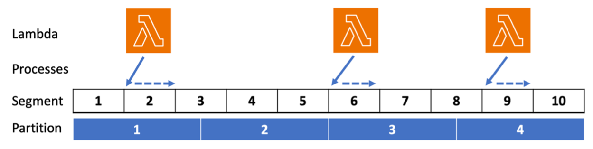

## Bulk update Amazon DynamoDB tables with AWS Step Functions

A solution that you can use to perform a bulk update on [Amazon DynamoDB](https://aws.amazon.com/dynamodb/) tables using [AWS Step Functions](https://aws.amazon.com/step-functions/). You can modify, deploy and test this solution as necessary to meet the needs of your own bulk update. 

A deep dive into this solution can be found in the blog post [Bulk update Amazon DynamoDB tables with AWS Step Functions](https://aws.amazon.com/blogs/database/bulk-update-amazon-dynamodb-tables-with-aws-step-functions/)

### Solution Approach

An efficient bulk update should distribute work across DynamoDB [table partitions](https://docs.aws.amazon.com/amazondynamodb/latest/developerguide/HowItWorks.Partitions.html).

[Parallel scan](https://docs.aws.amazon.com/amazondynamodb/latest/developerguide/Scan.html) allows you to logically break a table into a specified number of segments. 
This solution processes these segments in a random order to spread the work across underlying table partitions. Step Functions assigns segments to concurrent Lambda function invocations. Each Lambda function invocation iterates and updates the items in its assigned segment.

### Solution Parameters

When you deploy this solution, you have control over a set of parameters:

- `SourceTable` – The name of the DynamoDB table containing items for update. This table must exist in the same account and Region as the deployed solution.
- `ConsistentRead` – Should the process use consistent reads. Eventually consistent reads are half the price of strongly consistent reads. The default is to use strongly consistent reads.
- `TotalSegments` – The number of logical segments to break the SourceTable into. Increasing this value means more Lambda function invocations are needed to process the table, but each invocation process fewer items and will complete in less time. All invocations must complete within the maximum Lambda duration (15 minutes at the time of writing). The default is 1,000. The maximum is 1,000,000. 
- `DestinationTable` – The name of the DynamoDB table where the updated item will be written. This can be the same as SourceTable. This table must exist in the same account and Region as the deployed solution.
- `ParallelLambdaFunctions` – The maximum concurrent Lambda function invocations. Increasing this value means the bulk update progresses faster, but it will place more demand on tables. The default is 10.
- `RateLimiter` – Each Lambda invocation will process items as fast as possible. Set this parameter to the maximum number of items a Lambda function should process per second, or -1 for no rate limiting. The default is no rate limiting.

The `ScanAndUpdateTable` Lambda function contains a Python function named `process_item` that you modify to implement the specifics of your item update. 

Detailed guidance on these parameters can be found in the blog post [Bulk update Amazon DynamoDB tables with AWS Step Functions](https://aws.amazon.com/blogs/database/bulk-update-amazon-dynamodb-tables-with-aws-step-functions)

### Deployment

To deploy and run the solution, follow these steps:

1. clone this repository
2. modify the`process_item` function in `functions/scan-and-update-table.py` to include your desired item update(s)
3. deploy the solution with `sam deploy --guided`. Provide parameter values when prompted
4. run the deployed Step Function from the AWS CLI `aws stepfunctions start-execution --state-machine-arn <arn>`, or via the AWS Console

## Security

See [CONTRIBUTING](CONTRIBUTING.md#security-issue-notifications) for more information.

## License

This library is licensed under the MIT-0 License. See the LICENSE file.

